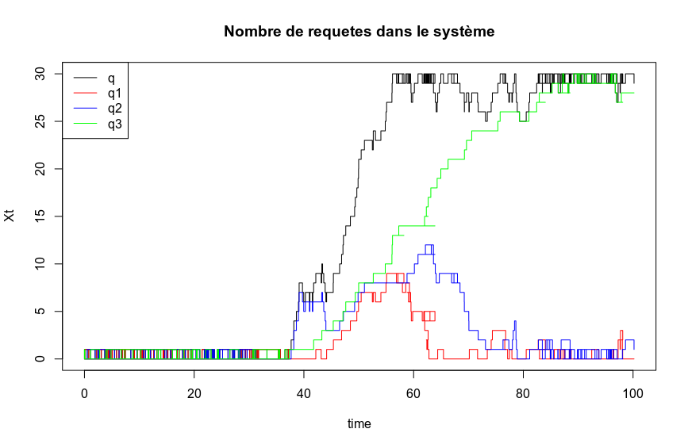
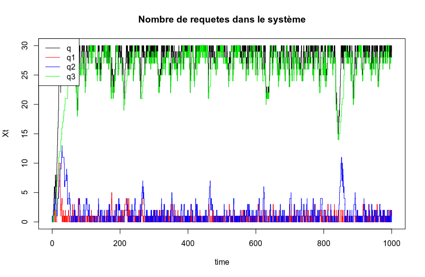

```{r setup, include=FALSE}
knitr::opts_chunk$set(echo = TRUE)
```

## Introduction

Le projet a été écrit en langage R. Le code n'est pas forcément le plus optimisé possible mais se veut le plus lisible possible.

Voici les conventions adoptées :

- $lambda\ (\lambda)$ représente l'intensité des requêtes.
- $mu\ (\mu)$ représente le temps de service.
- Ces deux paramètres sont utilisés par une loi exponentielle grace à la fonction rexp.
- La variable (structure) $t$ contient les éléments $t.clock$ et $t.end$ qui représentent respectivement le temps écoulé et le temps maximum virtuel de simulation.
- La variable $q$ représente le nombre d'éléments dans la queue ET en traitement par le serveur (on suppose qu'une requête quitte la queue lorsque son traitement est terminé).
- Les variables $q1$, $q2$, et $q3$ représentent les parts de la queue q attribuées à chaque priorité. On a donc $q=q1+q2+q3$.
- Les variables $tours$, $nbLaunch/1/2/3$, $nbTerm/1/2/3$, $nbCancelled$ et $sommeReq$ servent à générer les indicateurs (compteurs, moyennes).
- La variable $N$ représente le nombre maximum de requêtes dans le système, en comptant celle en cours de traitement. On a toujours $q \leq N$.
- Les paramètres $p1$, $p2$, et $p3$ représentent la proportion des requêtes prioritaires, normales et lentes, avec l'assertion de départ $p1+p2+p3=1$ (ligne 4).
- La deuxième assertion de départ est $\lambda \neq \mu$ : On ne pourrait pas calculer le nombre moyen de reqêtes à un instant t théorique s'ils étaient égaux car on aurait $\rho = 1$ et donc une division par zéro dans la formule de l'espérance de $X_t$ (ligne 5). Cependant, il est tout à fait possible de ne pas calculer cette espérance théorique et d'avoir les deux paramètres égaux à condition de commenter l'assertion et le calcul en question.
- La paramètre $debug$ est un boolean qui permet d'afficher toutes les informations sur les requêtes durant l'exécution (lorsqu'il vaut TRUE).
- Le paramètre $plotXt$ est un boolean qui, lorsqu'il vaut TRUE, permet de calculer un graphique représentant $X_t$ en fonction de $t.clock$. Attention, l'activation de ce paramètre ralentit énormément la simulation (il ne faut pas l'activer si le temps max est supérieur à 10000).
- On va traiter les éléments dans la queue selon le modèle fifo.
- Il est possible de n'utiliser qu'un seul type de requête avec le réglage suivant : $p1=1,\ p2=0,\ p3=0$.
- La simulation est dynamique : pas de structure de données complexes ou de génération statique au démarrage.

## Gestion des priorités

La priorité des requêtes est définie par le tirage d'un nombre aléatoire dans $[0,1]$. Les requêtes sont ensuites placés dans la Queue. Pour cela, la variable $q$ est incrémentée, et la variable $q_x$ où $x$ est le type de requeête est également incrémentée.

Le système va ensuite toujours traiter les requêtes par priorité, donc il commence par vérifier $q1$, puis $q2$, et enfin $q3$. Si jamais le système traite une requête non prioritaire et qu'une nouvelle requête, cette fois prioritaire, arrive, il va automatiquement la traiter une fois celle en cours terminée.

Nous venons donc en réalité de séparer notre queue en 3 "sous"-queues dynamiques de modèle fifo. La queue principale n'est donc plus dépendante du modèle fifo, puisque les priorités entrent en jeux. Ces trois "sous"-queues sont ensuites traitées dans l'ordre expliqué ci-dessus, avec pour contrainte de ne pas dépasser la taille maximale $N$ à elles trois. Donc $(q=q1+q2+q3)\leq N$.

Il aurait aussi été possible de choisir un autre modèle de queue, comme un choix aléatoire. Mais en appliquant le système avec les trois "sous"-queues, ce choix n'aurait pas provoqué de changement dans le déroulé de la simulation (les jobs de même priorité uniquement auraient été traités dans un ordre aléatoire).

## Nombre de reqêtes dans le système à un instant $t$

Le nombre de requêtes dans le système à un instant $t$ est noté $X_t$. Dans ce script, ce nombre correspond à la variable $q$. Il est intéressant de représenter ce nombre sous forme de graphique pour voir, par exemple, si la queue est arrivée à saturation durant la simulation. Il est encore plus intéressant de représenter également $q1$, $q2$ et $q3$ sur le même graphique pour voir quel type de requêtes est le mieux traité par le serveur.

Voici un exemple de schéma, lancé avec la commande suivante `simQueue(2 ,1.9,30,100,1/3,1/3,1/3,FALSE,TRUE)`


On remarque qu'au démarrage (jusqu'a environ un temps de 40), les requêtes sont traitées au fur et à mesure de leur génération, et donc $E(Xt)\simeq1$. Ce phénomène se produit car lambda et mu on des valeurs très proches. L'intensité et le temps de traitement sont donc preque les mêmes.

Obsevons ce qu'il se passe sur une plus longue durée avec les mêmes paramètres\newline


On remarque que les requêtes ne s'accumulent pas dans les "sous"-queues 1 et 2 mais qu'elles sont très nombreuses dans la queue 3. En effet, comme le serveur traite en premier lieux les requêtes 1 et 2, il "laisse" plus facilement s'accumuler les requêtes 3.

## Calcul et mesure du nombre moyen de requêtes dans le système

Le nombre moyen de requêtes dans le système est l'espérance de $X_t$, $E(X_t)$.
Le script va calculer ce nombre théorique à chaque lancement, mais aussi mesurer le nombre moyen de requêtes dans le système par lui même. Cette mesure est réalisée grâce à la variable $sommeReq$. 

Le nombre théorique et le nombre mesuré sont en général prochent sur un long temps de simulation.

## Calcul et mesure du taux de perte

Le taux de perte, ou la probabilité de perte, représente le risque de perdre des requêtes suite à une surcharge de la queue. Ce taux est calculé de façon théorique par le script, et également mesuré. Les deux valeurs semblent se rappocher lors d'une longue simulation.

Afin d'avoir des indicateurs sur les pertes, le script affiche également le pourcentage de requêtes terminées, d'un point de vu global, et unitaire (pour chaque type de requête).

La probabilité de perte est la suivante :

$$P(X_t=N)=\frac{1-\rho}{1-\rho^{N+1}}\rho^N$$

D'une manière générale, on remarque que dès lors que $\lambda > \mu$, la probabilité de perte devient grande. Il serait donc cohérent de vouloir ajouter des serveurs si jamais le temps moyen de traitement est plus faible que l'intensité d'arrivé des requêtes.

## Un exemple qui fonctionne bien

On appelle la fonction `simQueue` de la façon suivante `simQueue(1.3333,1,30,100,1/3,1/3,1/3,FALSE,TRUE)`

```{r, echo=FALSE}
simQueue <- function(lambda, mu, N, t, p1, p2, p3, debug, plotXt) {
  
  print('*****[INFO] Vérification des paramètres*****')
  stopifnot(p1+p2+p3==1) # On arrête si p1+p2+p3 != 1
  stopifnot(lambda!=mu) # On arrête si lambda = mu (on ne veut pas ro = 1 pour éviter une division par 0)
  
  print('*****[INFO] Initialisation du serveur*****')
  t.end   <- t # Durée max de la simulation
  t.clock <- 0    # Durée courante

  q <- 0 # Queue Générale
  q1 <- 0 # Part p1
  q2 <- 0 # Part p2
  q3 <- 0 # Part p3
  nextJob <- rexp(1,lambda) # Tps avant le prochain job
  nextDep <- 0 # Prochain départ
  tours <- 0 # Variable pour compter les tours (nombre de jobs total)
  nbLaunch <- 0 # Nombre de jobs lancés (général)
  nbLaunch1 <- 0 # Nombre de jobs lancés (p1)
  nbLaunch2 <- 0 # Nombre de jobs lancés (p2)
  nbLaunch3 <- 0 # Nombre de jobs lancés (p3)
  nbTerm <- 0 # Nombre de jobs terminés (général)
  nbTerm1 <- 0 # Nombre de jobs terminés (p1)
  nbTerm2 <- 0 # Nombre de jobs terminés (p2)
  nbTerm3 <- 0 # Nombre de jobs terminés (p3)
  nbCancelled <- 0 # Nombre de jobs annulés
  sommeReq <- 0 # Somme de la séquence des nombres de requetes en queue (pour la moyenne)
  
  # Si l'utilisateur veut plotter, on prépare le plot
  if(plotXt) {
    xax <- 0 # Axe du temps
    yax <- 0 # Axe du nombre de requetes à un instant t (total)
    yax1 <- 0 # Axe du nombre de requetes à un instant t (p1)
    yax2 <- 0 # Axe du nombre de requetes à un instant t (p2)
    yax3 <- 0 # Axe du nombre de requetes à un instant t (p3)
  }

  #On va faire du fifo
  print('*****[INFO] Démarrage*****')
  while(t.clock < t.end) { # Tant que c'est pas fini
    if((nextJob < nextDep && q < N) || q == 0) { # Si c'est le 1er tour ou qu'on doit ajouter un job
      if(debug) # On affiche les jobs lancés en debug
        print('*****[DEBUG/INFO] Un job a été lancé !*****')
      t.clock = t.clock + nextJob # On augmente le tps virtuel
      if(q==0) { # Si la queue est vide
        nextDep = nextDep - nextJob # On peut préparer le prochain départ
      }
      nextJob = rexp(1,lambda) # On génère le job suivant
      q = q + 1 # On le met dans la queue
      v <- runif(1) # On tire un nombre dans [0,1]
      if(v < p1) { # Si la requete est prioritaire
        q1 = q1 + 1
        nbLaunch1 = nbLaunch1 + 1 # On le compte
      } else if(v < (p1+p2)) { # Sinon si la requete est normale
        q2 = q2 + 1
        nbLaunch2 = nbLaunch2 + 1 # On le compte
      } else { # Sinon la requete est lente
        q3 = q3 + 1
        nbLaunch3 = nbLaunch3 + 1 # On le compte
      }
      nbLaunch = nbLaunch + 1 # On le compte
    } else { # Sinon, on va peut être annuler ou terminer un job
      if(debug) # En mode debug
        print('*****[DEBUG/INFO] Un job a été terminé !*****')
      if(nextJob < nextDep && debug) # En mode debug
        print('*****[DEBUG/WARNING] Un job a été annulé !*****')
      if(nextJob < nextDep) # Si on était censés recevoir un job, on l'annule car la queue est pleine
        nbCancelled = nbCancelled +1
      t.clock = t.clock + nextDep # On augmente le tps virtuel
      nextJob = nextJob - nextDep # On peu préparer le prochain job
      nextDep = rexp(1,mu) # On génère le prochain départ (tps de service)
      q = q - 1 # On enlève le job annulé de la queue
      if(q1 > 0) { # On prend en priorité la q1
        q1 = q1 -1
        nbTerm1 = nbTerm1 + 1 # On le compte 
      } else if(q2 > 0) { # Puis la q2
        q2 = q2 -1
        nbTerm2 = nbTerm2 + 1 # On le compte 
      } else { # Et enfin la q3
        q3 = q3 - 1
        nbTerm3 = nbTerm3 + 1 # On le compte 
      }
      nbTerm = nbTerm + 1 # On le compte 
    }
    tours = tours + 1 # On compte les tours
    sommeReq = sommeReq + q # On somme la moyenne des requetes
    if(plotXt) { # Si on veut plotter
      xax = c(xax,t.clock) # On combine les vecteurs
      yax = c(yax,q) # On combine les vecteurs (total)
      yax1 = c(yax1,q1) # On combine les vecteurs (p1)
      yax2 = c(yax2,q2) # On combine les vecteurs (p1)
      yax3 = c(yax3,q3) # On combine les vecteurs (p1)
    }
  }
  
  if(plotXt) { # Si on veut plotter
    #Légende du graph
    plot(xax, yax, xlab="time", ylab="Xt", type="s", main="Nombre de requetes dans le système") # On plote
    points(xax, yax1, col="red", pch=NA_integer_)
    lines(xax, yax1, col="red",type="s")
    points(xax, yax2, col="blue", pch=NA_integer_)
    lines(xax, yax2, col="blue",type="s")
    points(xax, yax3, col="green", pch=NA_integer_)
    lines(xax, yax3, col="green",type="s")
    legend("topleft",legend=c("q","q1","q2","q3"), col=c("black", "red","blue","green"),lty=c(1,1,1,1), ncol=1)
  }
  
  print('*****[INFO] Nombre d\'éléments en queue (total) :*****')
  print(q)
  print('*****[INFO] Nombre d\'éléments en queue (p1) :*****')
  print(q1)
  print('*****[INFO] Nombre d\'éléments en queue (p2) :*****')
  print(q2)
  print('*****[INFO] Nombre d\'éléments en queue (p3) :*****')
  print(q3)
  print('*****[INFO] Nombre de jobs lancés (total) :*****')
  print(nbLaunch)
  print('*****[INFO] Nombre de jobs lancés (p1) :*****')
  print(nbLaunch1)
  print('*****[INFO] Nombre de jobs lancés (p2) :*****')
  print(nbLaunch2)
  print('*****[INFO] Nombre de jobs lancés (p3) :*****')
  print(nbLaunch3)
  print('*****[INFO] Nombre de jobs terminés (total) :*****')
  print(nbTerm)
  print('*****[INFO] Nombre de jobs terminés (p1) :*****')
  print(nbTerm1)
  print('*****[INFO] Nombre de jobs terminés (p2) :*****')
  print(nbTerm2)
  print('*****[INFO] Nombre de jobs terminés (p3) :*****')
  print(nbTerm3)
  print('*****[INFO] Pourcentage de jobs terminés (total) :*****')
  print(nbTerm/nbLaunch*100)
  print('*****[INFO] Pourcentage de jobs terminés (p1) :*****')
  print(nbTerm1/nbLaunch1*100)
  print('*****[INFO] Pourcentage de jobs terminés (p2) :*****')
  print(nbTerm2/nbLaunch2*100)
  print('*****[INFO] Pourcentage de jobs terminés (p3) :*****')
  print(nbTerm3/nbLaunch3*100)
  print('*****[INFO] Nombre de jobs annulés :*****')
  print(nbCancelled)
  print('*****[INFO] Nombre de tours :*****')
  print(tours)
  print('*****[INFO] Nombre moyen de requetes (simulé) :*****')
  print(sommeReq/tours)
  print('*****[INFO] Nombre moyen de requetes (théorique) :*****')
  ro <- lambda/mu
  Etx <- (((1-(ro^(N-1))) / (1-ro)) - N*(ro^(N))) * (ro / (1-(ro^(N+1))))
  print(Etx)
  print('*****[INFO] Taux de perte (simulé) :*****')
  print(nbCancelled/tours)
  print('*****[INFO] Taux de perte (théorique) :*****')
  print(((1-ro)/(1-ro^(N+1)))*ro^(N))
  print('*****[INFO] Simulation terminée*****')
}
simQueue(1.3333,1,30,100,1/3,1/3,1/3,FALSE,TRUE)
```